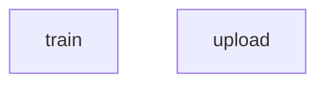

# Reddit NER for place names

This GitHub repository contains the code relating to the NER model for place name identification from Reddit comments. This model is hosted on the [HuggingFace Model Hub](https://huggingface.co/cjber/reddit-ner-place_names), allowing for easy use in Python.

### Project layout

```bash
src
├── common
│   └── utils.py  # utility functions
├── pl_data 
│   ├── conll_dataset.py  # reader for conll format
│   ├── datamodule.py  # generic datamodule
│   ├── jsonl_dataset.py  # reader for doccano jsonl format
│   └── test_dataset.py  # reader for testing dataset
├── pl_metric
│   └── seqeval_f1.py  # F1 metric
├── pl_module
│   ├── ger_model.py  # model implementation
└── train.py  # training script
```

### DVC pipeline

```yaml
stages:
  train:
    cmd: python -m src.train
    deps:
    - data/doccano_annotated.jsonl

    - src/train.py
    outs:
    - logs
    frozen: false
  upload:
    cmd: python -m src.train --upload=true
    deps:
      - data/doccano_annotated.jsonl

      - src/train.py
    frozen: true
```

### DVC dag


